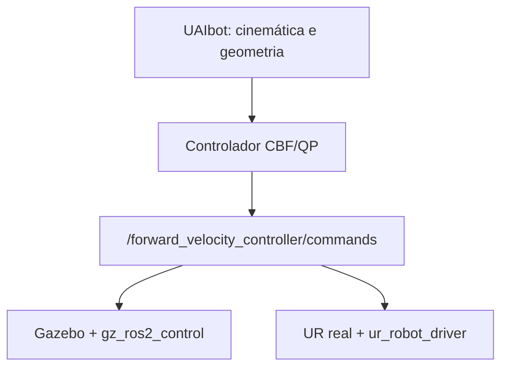

# Ambiente ROS 2 para controle CBF de manipuladores Universal Robots

Ambiente inicial da dissertacao para controle restrito no espaco de tarefa usando
CBFs, QPs e metricas de distancia diferenciaveis. A interface de controle e a mesma
na simulacao e no hardware real: velocidades articulares publicadas em
`/forward_velocity_controller/commands`.

> **Estado do projeto:** infraestrutura `v0.1.7` validada em Ubuntu 24.04 em
> 23 de julho de 2026. Os controladores CBF/QP ainda serao desenvolvidos sobre
> esta base.

## Arquitetura

O Gazebo e a planta e a fonte do estado no backend de simulacao. No backend real,
essas funcoes sao exercidas pelo `ur_robot_driver`. O UAIbot participa somente da
camada matematica e geometrica; ele nao constitui uma segunda planta de simulacao.



## Componentes

- Ubuntu 24.04
- ROS 2 Jazzy
- Python 3.12
- UAIbot 1.2.7
- Gazebo Harmonic
- RViz 2
- `ros2_control` e `gz_ros2_control`
- interface de linha de comando `ros2 control` (`ros2controlcli`)
- driver e descricao oficiais da Universal Robots
- simulacao oficial `ur_simulation_gz` 2.5.0, da linha compatível com Jazzy,
  sem o caminho opcional do MoveIt

O modelo padrao e o UR3e. O argumento `ur_type` permite usar UR5e e outros modelos
suportados pelos pacotes oficiais sem modificar os launch files.

## 1. Pre-requisitos do Ubuntu host

Instale Docker Engine e o plugin Docker Compose. O usuario deve conseguir executar:

```bash
docker --version
docker compose version
```

Para a interface grafica, confirme que `DISPLAY` esta definido e que o comando
`xhost` esta disponivel:

```bash
echo "$DISPLAY"
command -v xhost
```

Em Ubuntu, o comando `xhost` pertence ao pacote `x11-xserver-utils`:

```bash
sudo apt install x11-xserver-utils
```

## 2. Configuracao inicial

Na raiz do projeto:

```bash
make init
make diagnose
```

O diagnostico deve exibir o caminho absoluto do `docker/Dockerfile` e uma linha
contendo `existing_group`. Se aparecer apenas `groupadd --gid`, a copia local ainda
corresponde a versao 0.1.0.

O diagnóstico também mostra o commit da simulação UR. Para esta revisão, o valor
esperado é:

```text
048c80cd1faf87a2c74e14baadb65bd22b564d8f
```

Edite `.env` se necessario. Os campos principais sao:

```dotenv
UR_TYPE=ur3e
ROBOT_IP=192.168.0.10
ROS_DOMAIN_ID=42
```

Para preparar o UR5e no futuro, altere apenas:

```dotenv
UR_TYPE=ur5e
```

## 3. Construir e verificar

```bash
make build
make check
```

O alvo `make build` ativa explicitamente o perfil de desenvolvimento e constroi
o servico `ur_cbf_dev`. A imagem resultante usa a tag definida por `IMAGE_TAG`
no arquivo `.env`; nesta revisao, `ur-cbf-jazzy:0.1.7`.

O diagnostico verifica ROS 2 Jazzy, Python 3.12, UAIbot, criacao do modelo UR3e,
Gazebo, os pacotes da Universal Robots, o pacote local `ur_cbf_bringup` e a
instalacao do pacote `ros-jazzy-ros2controlcli`, alem da extensao de linha de
comando `ros2 control`. O script carrega explicitamente
`ur_cbf_ws/install/setup.bash` antes de consultar o indice de pacotes ROS.

## 4. Executar a simulacao

```bash
make sim
```

Antes de iniciar o container, esse alvo verifica `DISPLAY` e `xhost` e autoriza
automaticamente a conexao X11/XWayland apenas para o usuario local que executou
o comando. Nao e necessario criar ou montar manualmente `~/.Xauthority`.

O launch inicia Gazebo, RViz, `joint_state_broadcaster` e
`forward_velocity_controller` para o modelo definido por `UR_TYPE`.

Se a interface grafica for recusada pelo servidor X, a autorizacao pode ser
reaplicada manualmente antes de repetir o comando:

```bash
xhost +SI:localuser:"$(id -un)"
make sim
```

Em outro terminal, entre no ambiente de desenvolvimento:

```bash
make shell
```

Comandos de inspecao uteis:

```bash
ros2 control list_controllers
ros2 topic echo /joint_states
ros2 topic info /forward_velocity_controller/commands
```

## 5. Executar com o robo real

O host Ubuntu e o controlador do robo devem estar na mesma rede IP. Configure
`ROBOT_IP` em `.env`, instale o External Control URCap no robo e execute:

```bash
make real
```

O perfil real usa rede Docker do tipo `host`, necessaria para as conexoes do driver
com o controlador Universal Robots.

Antes de qualquer teste de movimento real:

1. valide a calibracao especifica do manipulador;
2. limite velocidades e aceleracoes;
3. mantenha o botao de emergencia acessivel;
4. teste inicialmente sem carga e em velocidade reduzida;
5. implemente watchdog para enviar velocidade nula se o controlador parar.

## 6. Recompilar o workspace

O entrypoint compila automaticamente quando `install/setup.bash` ainda nao existe.
Depois de modificar os pacotes, execute dentro do container:

```bash
cd /workspace/ur_cbf_ws
colcon build --symlink-install
source install/setup.bash
```

## 7. Verificacao minima

Antes de registrar uma revisao ou iniciar uma campanha experimental:

```bash
./scripts/check_system.sh
cd ur_cbf_ws
colcon test --event-handlers console_direct+
colcon test-result --verbose
```

O primeiro comando deve ser executado dentro do container, por exemplo com
`make shell`. Para cada experimento, registre a versao da imagem, os parametros
ROS/YAML e as seeds utilizadas.

## Estrutura

```text
.
├── docker/
│   ├── Dockerfile
│   ├── compose.yaml
│   └── entrypoint.sh
├── requirements/
│   └── requirements.txt
├── scripts/
│   └── check_system.sh
└── ur_cbf_ws/
    └── src/
        └── ur_cbf_bringup/
```

Arquivos locais de ambiente (`.env`), resultados do `colcon`, ZIPs de entrega e
artigos usados como referencia nao fazem parte do versionamento.

## Observacao sobre UAIbot e UR5e

A interface ROS e os backends Gazebo/real ja sao independentes do modelo. Entretanto,
o UAIbot 1.2.7 oferece atualmente a fabrica `Robot.create_ur_ur3e()`, mas nao uma
fabrica equivalente para o UR5e. Se o manipulador for alterado, o futuro modulo de
geometria devera fornecer um adaptador UR5e com seus parametros cinetostaticos e
primitivas de colisao, preservando a interface do controlador.
