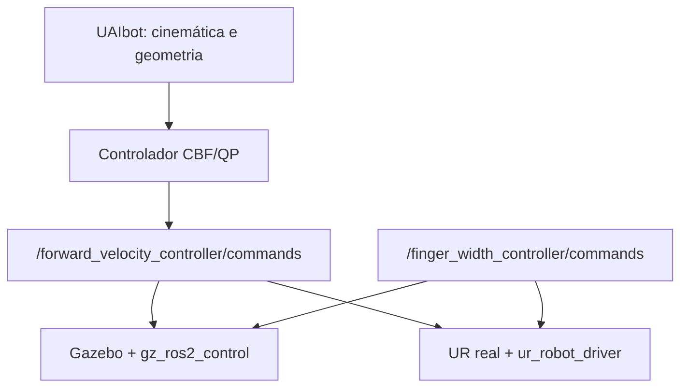

# Ambiente ROS 2 para controle CBF de manipuladores Universal Robots

Ambiente inicial da dissertacao para controle restrito no espaco de tarefa usando
CBFs, QPs e metricas de distancia diferenciaveis. A interface de controle e a mesma
na simulacao e no hardware real: velocidades articulares publicadas em
`/forward_velocity_controller/commands`.

> **Estado do projeto:** infraestrutura Docker `v0.2.0` e pacote de controle
> `ur_cbf_control` na revisao `0.5.0`. O controlador nominal pode operar por DLS
> ou por QP com limites articulares. A simulacao inclui uma OnRobot RG2/RG6
> selecionavel; as CBFs serao adicionadas na proxima etapa.

## Arquitetura

O Gazebo e a planta e a fonte do estado no backend de simulacao. No backend real,
essas funcoes sao exercidas pelo `ur_robot_driver`. O UAIbot participa somente da
camada matematica e geometrica; ele nao constitui uma segunda planta de simulacao.



## Componentes

- Ubuntu 24.04
- ROS 2 Jazzy
- Python 3.12
- UAIbot 1.2.7
- OSQP 1.1.3
- Gazebo Harmonic
- RViz 2
- `ros2_control` e `gz_ros2_control`
- interface de linha de comando `ros2 control` (`ros2controlcli`)
- driver e descricao oficiais da Universal Robots
- descricao OnRobot RG2/RG6 fixada por commit e adaptada a `gz_ros2_control`
- driver Modbus OnRobot RG2/RG6 fixado por commit para Tool I/O ou Compute Box
- simulacao oficial `ur_simulation_gz` 2.5.0, da linha compatível com Jazzy,
  sem o caminho opcional do MoveIt

O modelo padrao e o UR3e. O argumento `ur_type` permite usar UR5e e outros modelos
suportados pelos pacotes oficiais sem modificar os launch files.

## 1. Pre-requisitos do Ubuntu host

Instale Docker Engine e o plugin Docker Compose. O usuario deve conseguir executar:

```bash
docker --version
docker compose version
```

Para a interface grafica, confirme que `DISPLAY` esta definido e que o comando
`xhost` esta disponivel:

```bash
echo "$DISPLAY"
command -v xhost
```

Em Ubuntu, o comando `xhost` pertence ao pacote `x11-xserver-utils`:

```bash
sudo apt install x11-xserver-utils
```

## 2. Configuracao inicial

Na raiz do projeto:

```bash
make init
make diagnose
```

O `make init` cria ou migra o `.env` automaticamente. As chaves gerenciadas nesta
revisao ficam sempre em:

```dotenv
IMAGE_TAG=0.2.0
ONROBOT_TYPE=rg2
```

Valores locais ja configurados, como `ROBOT_IP`, `ROS_DOMAIN_ID` e os parametros
da Compute Box, sao preservados. Novas chaves recebem os valores padrao de
`.env.example`; portanto nao e necessario editar o arquivo manualmente.

O diagnostico deve exibir o caminho absoluto do `docker/Dockerfile` e uma linha
contendo `existing_group`. Se aparecer apenas `groupadd --gid`, a copia local ainda
corresponde a versao 0.1.0.

O diagnóstico também mostra o commit da simulação UR. Para esta revisão, o valor
esperado e:

```text
048c80cd1faf87a2c74e14baadb65bd22b564d8f
```

A descricao OnRobot e fixada no commit:

```text
29180b3fa9cba6555f3e515e789b8ccd34252fab
```

O driver do RG real e fixado no commit:

```text
b99abaccfbbe90f2096feff833f4c0849757a587
```

Os campos principais sao:

```dotenv
UR_TYPE=ur3e
ONROBOT_TYPE=rg2
ROBOT_IP=192.168.0.10
ROS_DOMAIN_ID=42
```

Para gravar o IP do UR e manter a conexao serial padrao sem editar `.env`:

```bash
make configure-real ROBOT_IP=192.168.0.10
```

Para usar uma OnRobot Compute Box por Modbus TCP:

```bash
make configure-real \
  ROBOT_IP=192.168.0.10 \
  ONROBOT_CONNECTION_TYPE=tcp \
  ONROBOT_IP=192.168.1.1 \
  ONROBOT_PORT=502
```

Para um ensaio pontual com UR5e, sem modificar arquivos:

```bash
make sim UR_TYPE=ur5e
```

A RG2 e a configuracao consolidada. O suporte parametrico da simulacao a RG6
permanece disponivel para comparacao pontual com:

```bash
make sim ONROBOT_TYPE=rg6
```

## 3. Construir e verificar

```bash
make build
make check
```

O alvo `make build` ativa explicitamente o perfil de desenvolvimento e constroi
o servico `ur_cbf_dev`. A imagem resultante usa a tag definida por `IMAGE_TAG`
no arquivo `.env`; nesta revisao, `ur-cbf-jazzy:0.2.0`.

O diagnostico verifica ROS 2 Jazzy, Python 3.12, UAIbot, OSQP, criacao do modelo
UR3e, Gazebo, os pacotes da Universal Robots, o pacote local `ur_cbf_bringup` e a
instalacao do pacote `ros-jazzy-ros2controlcli`, alem da extensao de linha de
comando `ros2 control`. O UAIbot e testado tanto pelo Python do ambiente virtual
quanto por `/usr/bin/python3`, interpretador gravado nos executaveis gerados pelo
`colcon`. O script carrega explicitamente `ur_cbf_ws/install/setup.bash` antes de
consultar o indice de pacotes ROS.

## 4. Executar a simulacao

```bash
make sim
```

Antes de iniciar o container, esse alvo verifica `DISPLAY` e `xhost` e autoriza
automaticamente a conexao X11/XWayland apenas para o usuario local que executou
o comando. Nao e necessario criar ou montar manualmente `~/.Xauthority`.

O launch inicia Gazebo, RViz, `joint_state_broadcaster`,
`forward_velocity_controller`, o controlador interno
`onrobot_joint_position_controller` e o adaptador de largura. A gripper definida
por `ONROBOT_TYPE` e acoplada ao frame `tool0`; o frame terminal publicado pelo
modelo e `gripper_tcp`.

Se a interface grafica for recusada pelo servidor X, a autorizacao pode ser
reaplicada manualmente antes de repetir o comando:

```bash
xhost +SI:localuser:"$(id -un)"
make sim
```

Em outro terminal, entre no ambiente de desenvolvimento:

```bash
make shell
```

Comandos de inspecao uteis:

```bash
ros2 control list_controllers
ros2 topic echo /joint_states
ros2 topic info /forward_velocity_controller/commands
```

### Primeiro ensaio da gripper

Confirme que ambos os controladores estao ativos:

```bash
ros2 control list_controllers
```

O resultado deve conter `forward_velocity_controller`,
`joint_state_broadcaster` e `onrobot_joint_position_controller` como `active`.
A interface externa da gripper recebe uma largura total em metros por
`Float64MultiArray`; o adaptador converte esse valor para as seis juntas fisicas
exportadas pelo Gazebo. A junta virtual `finger_width` permanece somente na
abstracao de largura e na descricao visual. Para RG2, teste primeiro uma abertura
intermediaria de 80 mm e depois 20 mm:

```bash
ros2 topic pub --once /finger_width_controller/commands \
  std_msgs/msg/Float64MultiArray "{data: [0.08]}"

ros2 topic echo /joint_states --once

ros2 topic pub --once /finger_width_controller/commands \
  std_msgs/msg/Float64MultiArray "{data: [0.02]}"
```

Para RG6, os mesmos comandos sao validos; seu intervalo completo e de 0 a
`0.160 m`, enquanto o RG2 aceita de 0 a `0.110 m`. A descricao fornece TCPs a
`0.218 m` (RG2) e `0.268 m` (RG6) da base da gripper.

O repositório [OnRobot_ROS2_Driver](https://github.com/tonydle/OnRobot_ROS2_Driver)
e compilado como backend do hardware real. O plugin de simulacao original do
driver utiliza Gazebo Classic; a composicao deste projeto usa exclusivamente
Gazebo Harmonic e `gz_ros2_control` no backend simulado.

O launch acrescenta o diretorio `share` que contem `onrobot_description` a
`GZ_SIM_RESOURCE_PATH`; assim, os meshes `package://` da gripper sao resolvidos
tanto no Gazebo quanto no RViz.

As tags `mimic` da descricao upstream sao removidas durante a construcao da
imagem e substituidas por comandos articulares explicitos. Isso evita depender
do suporte a restricoes `mimic` do motor fisico e preserva o movimento e as
colisoes dos dedos no Gazebo.

## 5. Executar com o robo real

O host Ubuntu e o controlador do robo devem estar na mesma rede IP. Instale o
External Control URCap no UR. Para a conexao serial do RG2 pelo Tool I/O, instale
tambem o RS485 Daemon URCap exigido pelo driver OnRobot e configure uma vez:

```bash
make configure-real ROBOT_IP=192.168.0.10
make build
make check
```

O modo serial e o padrao. O launch ativa automaticamente
`use_tool_communication`, cria `/tmp/ttyUR` e usa 1 Mbaud, paridade par, um stop
bit e 24 V. Depois de preparar a instalacao fisica e manter o acionamento do
robo desabilitado durante a inspecao inicial, execute:

```bash
make real
```

O perfil real usa rede Docker do tipo `host`, necessaria para as conexoes do driver
com o controlador Universal Robots. O braco usa `/controller_manager`; o RG2
usa `/onrobot/controller_manager`. A interface externa permanece identica a da
simulacao: `/finger_width_controller/commands` recebe uma largura total em metros.

Em outro terminal, entre no ambiente e valide sem comandar movimento:

```bash
make shell

ros2 control list_controllers
ros2 control list_controllers -c /onrobot/controller_manager
ros2 topic echo /onrobot/joint_states --once
ros2 topic info /finger_width_controller/commands
```

O resultado esperado inclui `forward_velocity_controller` ativo no gerenciador
do UR e `finger_width_controller` ativo no gerenciador OnRobot. Somente depois
dessa verificacao, com area livre e parada de emergencia acessivel, teste uma
abertura intermediaria do RG2:

```bash
ros2 topic pub --once /finger_width_controller/commands \
  std_msgs/msg/Float64MultiArray "{data: [0.08]}"
```

O adaptador rejeita valores nao finitos, vetores com dimensao diferente de um e
larguras fora de `[0, 0.110] m`. O driver upstream atualmente aplica internamente
metade da forca maxima do modelo; a forca ainda nao e um parametro ROS exposto.

Para testar apenas o UR, sem iniciar o RG2:

```bash
docker compose --env-file .env -f docker/compose.yaml --profile dev run --rm \
  ur_cbf_dev ros2 launch ur_cbf_bringup real.launch.py \
  ur_type:=ur3e robot_ip:=192.168.0.10 launch_gripper:=false
```

Antes de qualquer teste de movimento real:

1. valide a calibracao especifica do manipulador;
2. limite velocidades e aceleracoes;
3. mantenha o botao de emergencia acessivel;
4. teste inicialmente sem carga e em velocidade reduzida;
5. confirme o watchdog que envia velocidade articular nula se o controlador parar.

## 6. Recompilar o workspace

O entrypoint compila automaticamente quando `install/setup.bash` ainda nao existe.
Depois de modificar os pacotes, execute dentro do container:

```bash
cd /workspace/ur_cbf_ws
colcon build --symlink-install
source install/setup.bash
```

## 7. Verificacao minima

Antes de registrar uma revisao ou iniciar uma campanha experimental:

```bash
./scripts/check_system.sh
cd ur_cbf_ws
colcon test --event-handlers console_direct+
colcon test-result --verbose
```

O primeiro comando deve ser executado dentro do container, por exemplo com
`make shell`. Para cada experimento, registre a versao da imagem, os parametros
ROS/YAML e as seeds utilizadas.

## 8. Primeiro ensaio da camada de controle

O pacote `ur_cbf_control` inicia a validacao da cadeia de comandos antes do
controlador cartesiano e das CBFs. Seu ensaio monoarticular consulta a ordem das
juntas no proprio `forward_velocity_controller`, reordena `/joint_states` por nome,
aplica saturacao e publica comando nulo em caso de timeout ou interrupcao.

Compile e teste dentro do container:

```bash
cd /workspace/ur_cbf_ws
colcon build --symlink-install --packages-select ur_cbf_control
source install/setup.bash
colcon test --packages-select ur_cbf_control --event-handlers console_direct+
colcon test-result --verbose
```

Com a simulacao ativa, execute deliberadamente o pulso de baixa velocidade:

```bash
ros2 launch ur_cbf_control joint_velocity_pulse.launch.py \
  target_joint:=shoulder_pan_joint \
  execute_test:=true
```

O teste e desarmado por padrao e recusa execucao se `/gz_ros_control` nao estiver
presente. Consulte os criterios completos em
`ur_cbf_ws/src/ur_cbf_control/README.md`.

## 9. Regulacao cartesiana nominal por DLS e QP

A serie `0.3` consolidou a regulacao cartesiana por minimos quadrados amortecidos
(DLS). A revisao `0.4.0` acrescenta um QP convexo que minimiza o mesmo erro
cartesiano amortecido, mas incorpora os limites de velocidade articular como
restricoes do problema. Ainda nao existem CBFs nesta revisao.

O UAIbot calcula a posicao do efetuador e o Jacobiano translacional a partir das
juntas medidas no Gazebo. O frame controlado e `gripper_tcp`, no centro dos
dedos da gripper fechada, e nao o flange `tool0`. A selecao vem automaticamente
de `ONROBOT_TYPE`: a transformacao usa `0.218 m` para RG2 ou `0.268 m` para RG6,
incluindo a orientacao rigida definida pela descricao da ferramenta. O OSQP
resolve, em cada iteracao:

```text
min_qdot  1/2 ||J_v qdot - v||^2 + 1/2 lambda^2 ||qdot||^2
sujeito a -qdot_max <= qdot <= qdot_max
```

Sem restricoes ativas, a solucao QP e numericamente equivalente a DLS. O parametro
`controller_mode` permite executar os dois modos na mesma imagem para comparacao.

Com a simulacao ativa e os testes unitarios aprovados:

```bash
ros2 launch ur_cbf_control cartesian_position.launch.py \
  ur_type:=ur3e \
  onrobot_type:=rg2 \
  controller_mode:=qp \
  experiment_id:=cartesian_qp_ur3e_001 \
  execute_test:=true
```

Para produzir a referencia DLS no mesmo ambiente:

```bash
ros2 launch ur_cbf_control cartesian_position.launch.py \
  ur_type:=ur3e \
  onrobot_type:=rg2 \
  controller_mode:=dls \
  experiment_id:=cartesian_dls_ur3e_001 \
  execute_test:=true
```

O ensaio inicial define uma referencia relativa de `0.01 m` no eixo `z` do
cenario UAIbot, limita a velocidade cartesiana a `0.01 m/s` e a velocidade de
cada junta a `0.10 rad/s`. Ele e desarmado por padrao, exige `/gz_ros_control` e
publica comando nulo em timeout, interrupcao ou falha numerica. O tempo maximo
dinamico e `30 s` simulados, independente do fator de tempo real do Gazebo. Um
segundo limite de `180 s` reais protege contra travamento ou lentidao extrema.

Cada execucao grava em `results/` um JSON com parametros, versoes, seed, ordem
das juntas, posicoes, erro final, tempos simulado/real e a serie temporal de erro
e comandos. No modo QP, cada amostra inclui estado, iteracoes, tempo de solucao,
residuos primal/dual e restricoes ativas do OSQP. O log tambem apresenta o fator
de tempo real aproximado (`RTF`).

## Estrutura

```text
.
├── docker/
│   ├── Dockerfile
│   ├── compose.yaml
│   └── entrypoint.sh
├── requirements/
│   └── requirements.txt
├── scripts/
│   └── check_system.sh
└── ur_cbf_ws/
    └── src/
        ├── ur_cbf_bringup/
        └── ur_cbf_control/
```

Arquivos locais de ambiente (`.env`), resultados do `colcon`, ZIPs de entrega,
artigos usados como referencia e resultados experimentais locais nao fazem parte
do versionamento.

## Observacao sobre UAIbot e UR5e

A interface ROS e os backends Gazebo/real ja sao independentes do modelo. Entretanto,
o UAIbot 1.2.7 oferece atualmente a fabrica `Robot.create_ur_ur3e()`, mas nao uma
fabrica equivalente para o UR5e. O adaptador da revisao `0.5.0` rejeita modelos sem
implementacao explicita, em vez de aplicar parametros UR3e silenciosamente. Para
outro manipulador, deve-se adicionar seu adaptador cinetostatico preservando a
interface do controlador.
