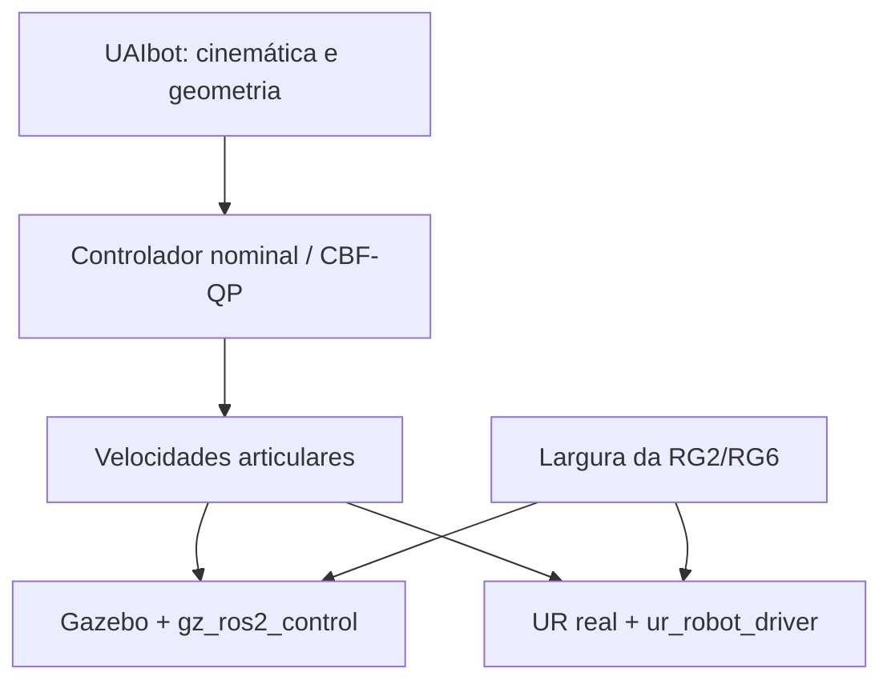

# Ambiente ROS 2 para controle CBF de manipuladores Universal Robots

Ambiente reproduzível para pesquisa de controle restrito no espaço de tarefa com
Control Barrier Functions (CBFs), programas quadráticos (QPs) e métricas de
distância diferenciáveis. A mesma interface comanda a planta simulada e o robô
real: velocidades articulares em
`/forward_velocity_controller/commands`.

> **Estado atual — revisão experimental 0.6.8:** infraestrutura Docker `0.2.0`,
> `ur_cbf_bringup` `0.3.8` e `ur_cbf_control` `0.6.8`. O QP já aceita a primeira
> CBF cinemática de autocolisão nos modos `monitor` e `enforce`. As 16 primitivas
> transparentes partem das 13 primitivas originais do braço UR3e no UAIbot; o
> ensaio atual usa `x=0; z=0,025 m` em `c21`, `z=0,025 m` em `c22/c23`,
> `y=z=0` em `c31`, `y=0` em `c32`, `xyz=(0;0;-0,02) m` em `c51` e
> `z=-0,018 m` em `c52`, mantendo a cápsula RG2.
> O padrão permanece `off` até validarmos poses e custo no container.

## Visão geral

O Gazebo Harmonic é a planta e a fonte de estado na simulação. No hardware, essas
funções são exercidas pelo `ur_robot_driver`. O UAIbot é usado somente para
cinemática e geometria; ele não cria uma segunda planta de simulação. MoveIt não
participa da arquitetura de controle.



### O que já está implementado

- ROS 2 Jazzy sobre Ubuntu 24.04 e Python 3.12;
- Gazebo Harmonic, RViz 2, `ros2_control` e `gz_ros2_control`;
- simulação parametrizada de manipuladores Universal Robots;
- OnRobot RG2/RG6 no RViz e no Gazebo, com backend real Modbus;
- interface comum da gripper em `/finger_width_controller/commands`;
- controle cartesiano nominal por DLS ou QP com OSQP 1.1.3;
- formulação de autocolisão `J_d qdot >= -gamma (d-d_safe)` integrada ao QP;
- TCP controlado em `gripper_tcp`, no centro dos dedos fechados;
- watchdogs, comando nulo em falhas e ensaios explicitamente armados;
- 16 primitivas visuais idênticas ao modelo UAIbot corrigido do projeto;
- resultados experimentais em JSON com parâmetros, versões, seed e métricas.

### Escopo dos modelos

| Camada | Estado atual |
|---|---|
| Bringup ROS/Gazebo | `ur_type` é parametrizado; UR3e é o padrão |
| Gripper | RG2 consolidada; RG6 disponível para comparação |
| Adaptador cinemático UAIbot | UR3e implementado e validado |
| CBF de autocolisão | núcleo/QP implementado; backend UAIbot em validação |
| Volumes visuais para CBF | 13 primitivas UR3e + cápsula RG2 de três objetos |
| Hardware real | UR via `ur_robot_driver`; RG2 via driver OnRobot |

Modelos sem adaptador ou geometria explícita são recusados, em vez de receberem
parâmetros do UR3e silenciosamente.

## Início rápido

### 1. Obter o projeto

```bash
git clone https://github.com/cayoalmeida0/ur-task-space-cbf-ros2.git
cd ur-task-space-cbf-ros2
```

### 2. Preparar, construir e verificar

```bash
make init
make diagnose
make build
make check
```

O `make init` cria e migra `.env` automaticamente. Não é necessário editar o
arquivo para usar a configuração padrão (`UR_TYPE=ur3e`, `ONROBOT_TYPE=rg2` e
`IMAGE_TAG=0.2.0`). Valores locais como `ROBOT_IP` e `ROS_DOMAIN_ID` são
preservados.

### 3. Iniciar a simulação

```bash
make sim
```

Em outro terminal:

```bash
cd ~/ur-task-space-cbf-ros2
make shell
ros2 control list_controllers
```

O resultado esperado inclui estes controladores ativos:

```text
joint_state_broadcaster
forward_velocity_controller
onrobot_joint_position_controller
```

Consulte o [guia de instalação](docs/SETUP.md) se o build ou a interface gráfica
falhar. Compatibilidade com WSL 2, inclusive a limitação observada em redes que
bloqueiam TLS dentro de containers, também está documentada nesse guia.

## Testes funcionais principais

Com `make sim` ativo e após entrar com `make shell`, teste a RG2:

```bash
ros2 topic pub --once /finger_width_controller/commands \
  std_msgs/msg/Float64MultiArray "{data: [0.08]}"

ros2 topic pub --once /finger_width_controller/commands \
  std_msgs/msg/Float64MultiArray "{data: [0.02]}"
```

Para inspecionar o movimento dos volumes visuais em três juntas, mantenha
`make sim` ativo e execute no host, em um segundo terminal:

```bash
make test-cbf-motion
```

Para manter os volumes no RViz e ocultá-los somente no Gazebo:

```bash
make down
make sim CBF_VOLUMES_GAZEBO=false
```

Para executar o ensaio cartesiano QP:

```bash
ros2 launch ur_cbf_control cartesian_position.launch.py \
  ur_type:=ur3e \
  onrobot_type:=rg2 \
  controller_mode:=qp \
  experiment_id:=cartesian_qp_ur3e_001 \
  execute_test:=true
```

Os procedimentos completos, critérios de aprovação e convenções de frames estão
no [guia da simulação](docs/SIMULATION.md) e na
[documentação do pacote de controle](ur_cbf_ws/src/ur_cbf_control/README.md).

## Verificação antes de uma revisão

Dentro do container:

```bash
./scripts/check_system.sh
cd /workspace/ur_cbf_ws
colcon test --event-handlers console_direct+
colcon test-result --verbose
```

O repositório também executa no GitHub uma verificação rápida de sintaxe,
metadados e testes unitários independentes do ROS. A validação completa continua
sendo a execução acima na imagem Docker, pois ela inclui os pacotes ROS, Xacro,
Gazebo e os launches instalados.

## Documentação

- [Instalação, configuração, build e diagnóstico](docs/SETUP.md)
- [Simulação, gripper, volumes visuais e ensaios](docs/SIMULATION.md)
- [Formulação e escopo da CBF de autocolisão](docs/SELF_COLLISION_CBF.md)
- [Preparação e segurança do robô real](docs/REAL_ROBOT.md)
- [Controle DLS/QP, proteções e metodologia](ur_cbf_ws/src/ur_cbf_control/README.md)
- [Como contribuir](CONTRIBUTING.md)
- [Histórico técnico de versões](VERSIONS.md)
- [Componentes e licenças de terceiros](THIRD_PARTY_NOTICES.md)

## Estrutura do repositório

```text
.
├── .github/workflows/       # verificação rápida no GitHub
├── docker/                  # imagem, Compose e entrypoint
├── docs/                    # guias de uso
├── requirements/            # dependências Python fixadas
├── scripts/                 # migração, diagnóstico e ensaios
└── ur_cbf_ws/src/
    ├── ur_cbf_bringup/      # simulação e backend real
    └── ur_cbf_control/      # controladores e experimentos
```

`.env`, `build/`, `install/`, `log/`, caches, ZIPs, artigos de referência e
resultados experimentais locais são deliberadamente excluídos do Git.

## Segurança e reprodutibilidade

Os ensaios de movimento são desarmados por padrão e publicam comando nulo quando
o estado ou a solução fica obsoleta. Mesmo assim, o backend real só deve ser
usado após seguir o [procedimento de segurança](docs/REAL_ROBOT.md), com área
livre, limites conservadores e parada de emergência acessível.

Cada experimento deve registrar a imagem Docker, modelo, parâmetros ROS/YAML,
seed e versão do código. O projeto é distribuído sob a licença
[Apache-2.0](LICENSE); componentes externos permanecem sob suas próprias
licenças.
