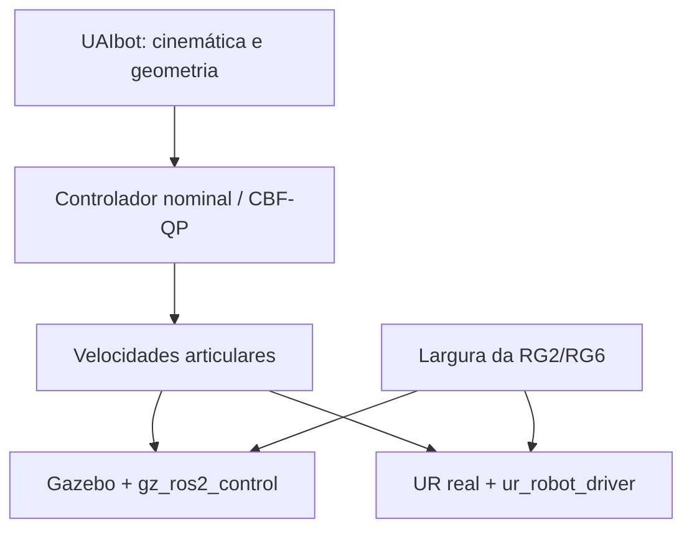

# Ambiente ROS 2 para controle CBF de manipuladores Universal Robots

Ambiente reproduzível para pesquisa de controle restrito no espaço de tarefa com
Control Barrier Functions (CBFs), programas quadráticos (QPs) e métricas de
distância diferenciáveis. A mesma interface comanda a planta simulada e o robô
real: velocidades articulares em
`/forward_velocity_controller/commands`.

> **Estado atual — revisão experimental 0.6.38:** infraestrutura Docker `0.2.0`,
> `ur_cbf_bringup` `0.3.18` e `ur_cbf_control` `0.6.38`. A tarefa de
> manipulação pick-and-place usa exatamente três alvos cartesianos: cubo,
> caixa e HOME. Não são inseridos waypoints explícitos de aproximação,
> elevação ou retração; a CBF do cilindro protege o deslocamento direto até o
> cubo. As CBFs de autocolisão e de fronteira do workspace permanecem no modo
> `enforce`. A cena usa mesa de altura `0,15 m`, cubo em `[-0,35, 0, 0,17]` e
> caixa em `[-0,30, 0,18]`, no frame `base_link`. O HOME padrão é a pose inicial
> capturada após a estabilização. No perfil `challenging`, os limites são
> `0,08 m/s` no espaço cartesiano e `0,60 rad/s` nas juntas.

## Visão geral

O Gazebo Harmonic é a planta e a fonte de estado na simulação. No hardware, essas
funções são exercidas pelo `ur_robot_driver`. O UAIbot é usado somente para
cinemática e geometria; ele não cria uma segunda planta de simulação. MoveIt não
participa da arquitetura de controle.



### O que já está implementado

- ROS 2 Jazzy sobre Ubuntu 24.04 e Python 3.12;
- Gazebo Harmonic, RViz 2, `ros2_control` e `gz_ros2_control`;
- simulação parametrizada de manipuladores Universal Robots;
- OnRobot RG2/RG6 no RViz e no Gazebo, com backend real Modbus;
- interface comum da gripper em `/finger_width_controller/commands`;
- controle cartesiano nominal por DLS ou QP com OSQP 1.1.3;
- formulação de autocolisão `J_d qdot >= -gamma (d-d_safe)` integrada ao QP;
- CBF de fronteira do workspace com seis restrições cartesianas axis-aligned;
- CBF externa para o cilindro da mesa, aplicada aos volumes de colisão do robô;
- tarefa física simulada de pick-and-place com comando da garra RG2;
- modo posicional vertical, que mantém a inclinação da garra e libera o yaw;
- métricas de manipulabilidade (`sigma_min`, condição e índice de Yoshikawa)
  registradas em cada amostra;
- witness points de autocolisão e marcadores da fronteira do workspace no RViz;
- TCP controlado em `gripper_tcp`, no centro dos dedos fechados;
- watchdogs, comando nulo em falhas e ensaios explicitamente armados;
- 19 primitivas visuais do modelo UAIbot corrigido, incluindo os oito volumes
  originais da RG2 no elo final;
- resultados experimentais em JSON com parâmetros, versões, seed e métricas.

### Escopo dos modelos

| Camada | Estado atual |
|---|---|
| Bringup ROS/Gazebo | `ur_type` é parametrizado; UR3e é o padrão |
| Gripper | RG2 consolidada; RG6 disponível para comparação |
| Adaptador cinemático UAIbot | UR3e implementado e validado |
| CBF de autocolisão | validada em simulação nos modos `monitor` e `enforce` |
| CBF de workspace | validada com limite inferior ajustado para a soltura |
| Volumes visuais para CBF | 13 primitivas UR3e + 8 primitivas UAIbot da RG2 |
| Hardware real | UR via `ur_robot_driver`; RG2 via driver OnRobot |

Modelos sem adaptador ou geometria explícita são recusados, em vez de receberem
parâmetros do UR3e silenciosamente.

## Início rápido

### 1. Obter o projeto

```bash
git clone https://github.com/cayoalmeida0/ur-task-space-cbf-ros2.git
cd ur-task-space-cbf-ros2
```

### 2. Preparar, construir e verificar

```bash
make init
make diagnose
make build
make check
```

O `make init` cria e migra `.env` automaticamente. Não é necessário editar o
arquivo para usar a configuração padrão (`UR_TYPE=ur3e`, `ONROBOT_TYPE=rg2` e
`IMAGE_TAG=0.2.0`). Valores locais como `ROBOT_IP` e `ROS_DOMAIN_ID` são
preservados.

### 3. Iniciar a simulação

```bash
make sim
```

Em outro terminal:

```bash
cd ~/ur-task-space-cbf-ros2
make shell
ros2 control list_controllers
```

O resultado esperado inclui estes controladores ativos:

```text
joint_state_broadcaster
forward_velocity_controller
onrobot_joint_position_controller
```

Consulte o [guia de instalação](docs/SETUP.md) se o build ou a interface gráfica
falhar. Compatibilidade com WSL 2, inclusive a limitação observada em redes que
bloqueiam TLS dentro de containers, também está documentada nesse guia.

## Testes funcionais principais

Com `make sim` ativo e após entrar com `make shell`, teste a RG2:

```bash
ros2 topic pub --once /finger_width_controller/commands \
  std_msgs/msg/Float64MultiArray "{data: [0.08]}"

ros2 topic pub --once /finger_width_controller/commands \
  std_msgs/msg/Float64MultiArray "{data: [0.02]}"
```

Para inspecionar o movimento dos volumes visuais em três juntas, mantenha
`make sim` ativo e execute no host, em um segundo terminal:

```bash
make test-cbf-motion
```

Os volumes ficam visíveis no RViz e ocultos no Gazebo por padrão:

```bash
make down
make sim CBF_VOLUMES_GAZEBO=false
```

Para executar o ensaio cartesiano QP:

```bash
ros2 launch ur_cbf_control cartesian_position.launch.py \
  ur_type:=ur3e \
  onrobot_type:=rg2 \
  controller_mode:=qp \
  experiment_id:=cartesian_qp_ur3e_001 \
execute_test:=true
```

### Ensaio de manipulação pick-and-place validado

Com a simulação ativa e após entrar no container com `make shell`:

```bash
ros2 launch ur_cbf_control cartesian_position.launch.py \
  ur_type:=ur3e \
  onrobot_type:=rg2 \
  task_type:=manipulation \
  trajectory_profile:=challenging \
  task_control_mode:=position_vertical \
  orientation_target_mode:=vertical \
  controller_mode:=qp \
  self_collision_cbf_mode:=enforce \
  workspace_cbf_mode:=enforce \
  self_collision_witness_mode:=closest \
  manipulation_object_frame:=base_link \
  cube_position:="[-0.35, 0.0, 0.17]" \
  drop_position:="[-0.30, 0.18]" \
  manipulation_home_mode:=initial \
  max_control_duration:=120.0 \
  max_wall_control_duration:=600.0 \
  experiment_id:=pick_place_equal_radius_fast_boundary02_001 \
  execute_test:=true
```

Para manter os volumes de colisão visíveis no RViz, mas ocultos no Gazebo:

```bash
CBF_VOLUMES=true CBF_VOLUMES_GAZEBO=false make sim
```

O ensaio registra três chegadas — cubo, caixa e HOME — no resultado experimental
em JSON no diretório `/workspace/results`. Ao chegar ao cubo a RG2 fecha; ao
chegar à caixa ela abre; o terceiro alvo retorna à pose HOME.

### Três cenários de teste

Os launchers abaixo iniciam a cena Gazebo e o controlador com os parâmetros
coerentes entre si. Cada execução tem somente `cubo -> caixa -> HOME`. Eles usam
`task_control_mode:=position_vertical`, portanto a
posição e a inclinação da garra são reguladas, enquanto o yaw permanece livre.
A mesa é tratada
como um cilindro de colisão com margem de `0,01 m`; a altura do cubo é sempre
`table_height + cube_size/2`.

| Launcher | Mesa/cubo no `base_link` | Altura | Caixa no `base_link` |
|---|---:|---:|---:|
| `manipulation_scenario_01` | `[-0,35, 0,00]` | `0,15 m` | `[-0,30, 0,18]` |
| `manipulation_scenario_02` | `[-0,28, -0,20]` | `0,20 m` | `[-0,10, 0,33]` |
| `manipulation_scenario_03` | `[-0,18, 0,26]` | `0,25 m` | `[0,16, -0,27]` |

Com a imagem em execução, use um único cenário por vez:

```bash
ros2 launch ur_cbf_bringup manipulation_scenario_01.launch.py
ros2 launch ur_cbf_bringup manipulation_scenario_02.launch.py
ros2 launch ur_cbf_bringup manipulation_scenario_03.launch.py
```

Os resultados registram a menor singularidade `sigma_min` e o maior número de
condição observados. Nesta revisão a manipulabilidade é critério diagnóstico,
não uma restrição adicional do QP. A CBF do cilindro é a proteção geométrica
durante o caminho direto; o cubo é o alvo intencional da pega, não um obstáculo
proibido.

Para comparar com orientação 6D completamente fixa, use o launcher genérico e
`task_control_mode:=pose orientation_target_mode:=vertical`. Para a configuração
posicional sem restrição angular, use `task_control_mode:=position`.

### Diagnóstico do RobotModel no RViz

O display `RobotModel` utiliza o tópico `/robot_description` publicado pelo
`robot_state_publisher` e o frame fixo `base_link`. As configurações do RViz
usam durabilidade `Transient Local`, necessária para que a descrição seja
recebida mesmo quando o RViz inicia após o publicador.

Para verificar a publicação dentro do container:

```bash
ros2 topic info /robot_description -v
```

Deve existir um publicador associado ao `robot_state_publisher`. Após atualizar
o projeto, é necessário reconstruir o workspace e reiniciar a simulação para
carregar a configuração corrigida do RViz.

Os procedimentos completos, critérios de aprovação e convenções de frames estão
no [guia da simulação](docs/SIMULATION.md) e na
[documentação do pacote de controle](ur_cbf_ws/src/ur_cbf_control/README.md).

## Verificação antes de uma revisão

Dentro do container:

```bash
./scripts/check_system.sh
cd /workspace/ur_cbf_ws
colcon test --event-handlers console_direct+
colcon test-result --verbose
```

O repositório também executa no GitHub uma verificação rápida de sintaxe,
metadados e testes unitários independentes do ROS. A validação completa continua
sendo a execução acima na imagem Docker, pois ela inclui os pacotes ROS, Xacro,
Gazebo e os launches instalados.

## Documentação

- [Instalação, configuração, build e diagnóstico](docs/SETUP.md)
- [Simulação, gripper, volumes visuais e ensaios](docs/SIMULATION.md)
- [Formulação e escopo da CBF de autocolisão](docs/SELF_COLLISION_CBF.md)
- [Preparação e segurança do robô real](docs/REAL_ROBOT.md)
- [Controle DLS/QP, proteções e metodologia](ur_cbf_ws/src/ur_cbf_control/README.md)
- [Como contribuir](CONTRIBUTING.md)
- [Histórico técnico de versões](VERSIONS.md)
- [Componentes e licenças de terceiros](THIRD_PARTY_NOTICES.md)

## Estrutura do repositório

```text
.
├── .github/workflows/       # verificação rápida no GitHub
├── docker/                  # imagem, Compose e entrypoint
├── docs/                    # guias de uso
├── requirements/            # dependências Python fixadas
├── scripts/                 # migração, diagnóstico e ensaios
└── ur_cbf_ws/src/
    ├── ur_cbf_bringup/      # simulação e backend real
    └── ur_cbf_control/      # controladores e experimentos
```

`.env`, `build/`, `install/`, `log/`, caches, ZIPs, artigos de referência e
resultados experimentais locais são deliberadamente excluídos do Git.

## Segurança e reprodutibilidade

Os ensaios de movimento são desarmados por padrão e publicam comando nulo quando
o estado ou a solução fica obsoleta. Mesmo assim, o backend real só deve ser
usado após seguir o [procedimento de segurança](docs/REAL_ROBOT.md), com área
livre, limites conservadores e parada de emergência acessível.

Cada experimento deve registrar a imagem Docker, modelo, parâmetros ROS/YAML,
seed e versão do código. O projeto é distribuído sob a licença
[Apache-2.0](LICENSE); componentes externos permanecem sob suas próprias
licenças.
